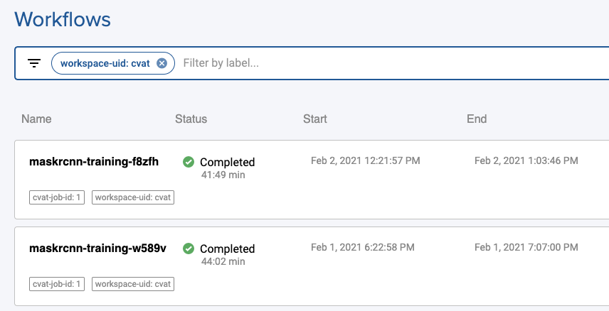
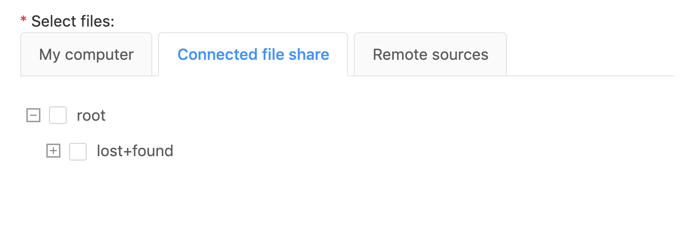

You can use your trained models to automatically pre-annotate your data. This can save you a lot of time since you don't have to annotate images from scratch. On Onepanel, you can leverage these features to pre-annotate bounding boxes or polygon masks.

## Uploading your trained model into CVAT Workspace

First, you will need to upload your trained model into CVAT.

1. First, navigate to the Workflow that you used to train your model. You can go to **Workflows** and then filter by `workspace-uid: <your-cvat-workspace-uid>`.

    

2. Click on the **train-model** task and then click **Outputs** in the task panel on the right hand side.

    

3. In the file browser, click on **output** > **model** and then click the copy icon next to the location.

    

    :::note
    The screenshot above is showing MaskRCNN model output, TensorFlow Object Detection output has a few more files and the model name is `frozen_inference_graph.pb`.
    :::

4. Return to your CVAT Workspace and click on **Models** in the top menu and then click on **Create new model** button.

5. Click on **Connected file share**.

    
  
6. Click the Onepanel icon in bottom right corner to bring up the Workspace panel. Under **Sync files**, in the **Workspace path** field, type in the path you want to sync your model data into, and then paste the path you copied above into **Object storage location** field.

    

7. Click **Sync to Workspace**, you should see a log showing data being synced. Once complete, close the **Logs** panel.

8. Click **Refresh** under **Connected file share**.

    

9.  Expand the file tree to navigate to your model folder and select **classes.csv** and **onepanel_trained_model.h5** (or **frozen_inference_graph.pb** if using TFOD).

    

10. Enter a name for your model and click **Submit**.

11. Once the model is uploaded, click **Models** to verify that it's there.

    

12. Follow the steps in the next section below to use this model for automatic annotation.

## Running automatic annotation in CVAT

1. The first step is to upload your model on CVAT or use our default models which are available on CVAT. 

2. Click on **Automatic annotation** under Actions menu. 

  

3. Select the model for pre-annotation. By default, you can use RCNN Object Detector (from Tensorflow Object Detection API) or  Mask RCNN Object Detector for semantic segmentation.

4. If you selected any models other than default ones then you will asked to do class mapping. CVAT will automatically map class from task to model's class.

  

5. Click on **Submit** to start pre-annotation. Once it's done, you can click on **Open** to access the annotation.
  

6. Here is a output from default object detection model.

  

## Hardware requirements 

For training a model(Execute training Workflow), you can choose any GPU machine from the list. All of our models will work on any of the GPU machine. But if you want to train it faster, then we suggest you select machines with multiple GPUs (i.e 8 V100).

See the table below which details machine type with the corresponding runtime to perform pre-annotations.
For this test, we used a task with **3550 images (2GB)** to perform pre-annotations.

Machine     | Time     
------------|---------------
K80         | 160 minutes  
V100        | 80 minutes 
V100 x 4    | 21 minutes 

Run time depends on factors such as **model, number of images, type of machine.**

The above data was generated for ssd-mobilenet-v2 model which is the model we suggest to use in normal circumstances. If you have complex annotations and want to use faster-rcnn based model, then it might take slightly more time. But note that it won’t significantly alter the data presented above.

The other factor is image compression. By default, CVAT compresses images by 50%. We did some testing to find out if we use original images (without compression) then how much time it will take.

It turns out that if you use the original images without compression, your pre-annotation time will be increased by ~5-6% of that of 50% compressed images. So in the above table, if you use images without compression and use a V100, it will take 84 minutes instead of 80 minutes. Note that this compression does not affect annotation in any way.

Note that this data was calculated on 3550 images (1280 x 960)(total size=2GB), so if your data size is different you can easily extrapolate the data from the above table. For example, if you have 10gb of images then ideally it will take around 400 minutes on a V100 GPU. 

If the resolution of your images is slightly different, then it won’t affect run time significantly. In fact, if the difference is ~200 pixels then it won’t change at all, generally.

If you still have any questions, feel free to reach out to us at info@onepanel.io