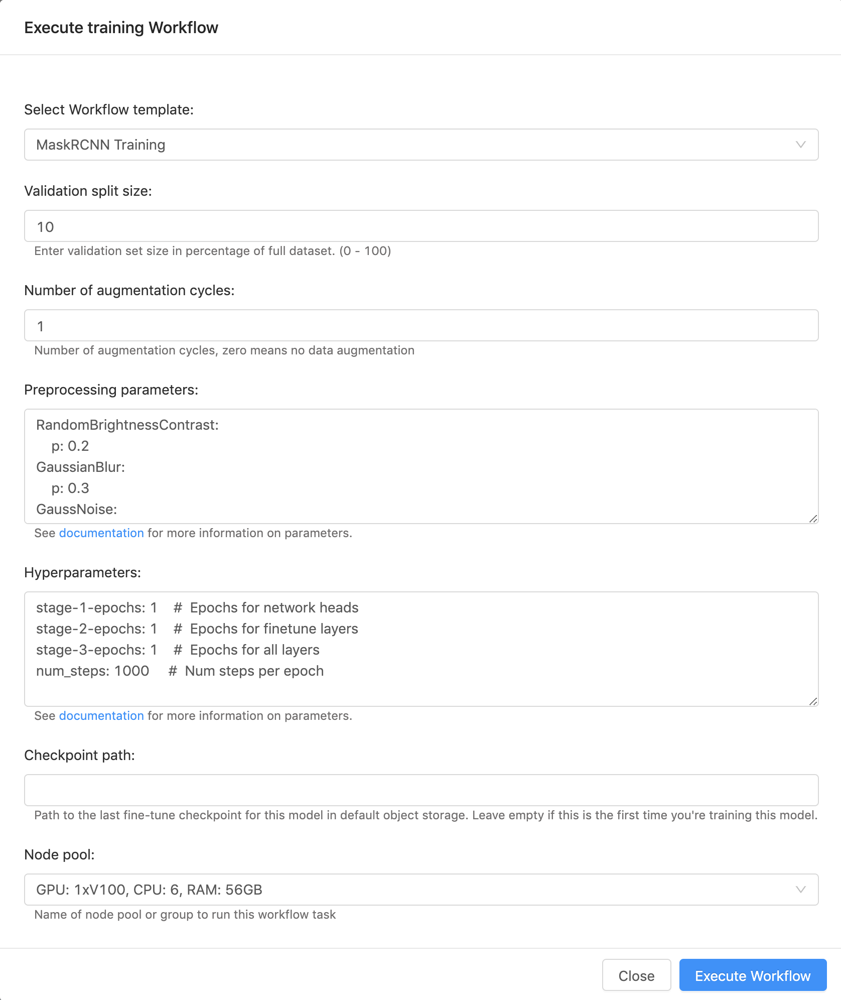

You can train object detection or semantic segmentation models directly from CVAT, which you can then use to automatically pre-annotate new data. This dramatically reduces the time it takes to train new models and iteratively improve your models. Moreover, apart from built-in models that we provide, you easily add custom model training Workflows and use them for pre-annotation as well.

1. Click on **Open** for a task you want to train a model on.
  
  

2. Click on **Job #X**, where X could be any job number. Annotate few frames. For testing you can just annotate one frame. But ideally you want to have thousands of objects to train a deep learning model on. Alternatively, you can just run pre-annotation if your labels are common ones.

3. Click on **Actions** for a task you want to train a model on. Then, click on **Execute training Workflow**.

  

4. Select a training Workflow Template. By default, you can use **TF Object Detection Training** for object detection or **MaskRCNN Training** for semantic segmentation.

  

  :::tip
  Note you can easily add your own models as well. See our [documentation](/docs/reference/cvat/custom-models) for more information on adding custom models. 
  :::

5. Update [hyperparameters](/docs/reference/workflows/training) depending on your model and data. These training Workflows also include [data augmentation](/docs/reference/workflows/data-augmentation) fields that you can adjust accordingly as well.

6. You can optionally copy and paste a model path from previously trained model or leave this field empty.

7. Click **Submit**. This will execute the training Workflow for the selected model. You can view real-time logs and view TensorBoard by clicking **Open Workflow details**.
  
  

  :::note
  You can also use this trained model to run automatic pre-annotation in CVAT. See [documentation](/docs/reference/cvat/automatic-annotation) for more information on automatic pre-annotation.
  :::

