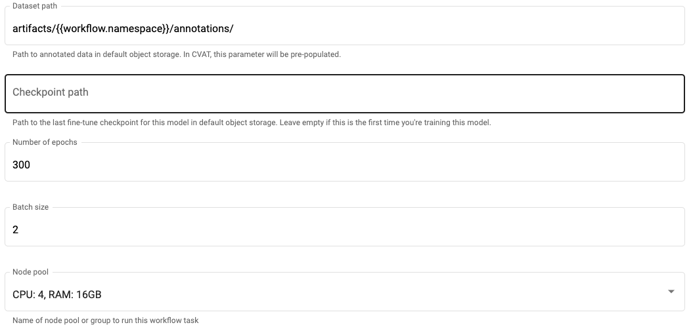
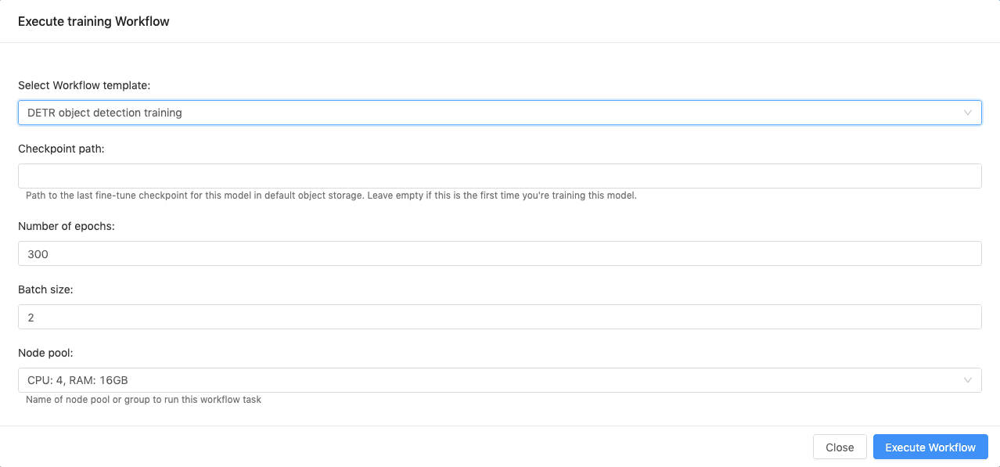

This guide will walk you through the process adding custom object detection or semantic segmentation training Workflow Templates in Onepanel that can be triggered from CVAT just like the [built-in model training Workflows](/docs/reference/cvat/built-in-models)

The steps to add your custom model training are as follows:

1. Make sure your training code supports CVAT's annotation formats.
2. Overview of the **CVAT training Workflow Template** that you'll be using as base.
3. Update your training code's input and output directory structures and push to a Git repository (e.g. GitHub).
4. Update **CVAT training Workflow Template** to reference your training code and install dependencies (if any).
5. Use your new Workflow Template to train models directly from CVAT.

We will walk through these steps by adding the [DEtection TRansformer (DETR)](https://github.com/facebookresearch/detr) model for semantic segmentation.

## 1. Supported annotation formats

When you click **Execute training Workflow** in CVAT, the annotation data dump is uploaded to your [default object storage](/docs/deployment/configuration/files#artifactrepository) and then a Workflow Template (containing the relevant training code) is executed with reference to the location of the annotation data dump.

Now that you know how this feature works, the only requirement is that your training code needs to support the annotation formats that are supported by CVAT. For example, if your training code accepts data that follows COCO format (i.e JSON) then you need to indicate that in your newly created Workflow Template by updating the `dump_format` field (more on this field later in steps below).

The following annotation formats are supported by CVAT:

- MS COCO (`cvat_coco`)
- YOLO (`cvat_yolo`)
- TF Detection API (TFRecord) (`cvat_tfrecord`)
- MOT (`cvat_mot`)
- LabelMe (`cvat_label_me`)

## 2. CVAT training Workflow Template Overview

The **CVAT training Workflow Template** is the base template you can use to add any custom object detection or semantic segmentation model that will work directly with any CVAT Workspace. 

This template is available in Onepanel by navigating to **Workflows** > **Workflow Templates** > **Create Template** and selecting **CVAT Training** under **Templates**.

Note that the **CVAT Training** Workflow Template has in-line comments describing the fields and what you would need to change. You will only need to change (or in some cases remove) the fields marked with `[CHANGE]`.

Some important notes about this template:

1. The fields with the `cvat-` prefix are automatically populated by CVAT. The `dump_format` indicates to CVAT in which format to dump the annotations.
2. Your training code is cloned from your Git repository into `/mnt/src/train`.
3. The annotation dump is downloaded from object storage to `/mnt/data/datasets` and if any checkpoint models are selected, that is downloaded to `/mnt/data/models`.
4. Any output from your training code (model and `classes.csv` file) is expected to be written to `/mnt/output`. Files written to this location will be automatically uploaded to your default object storage and accessible to CVAT and other Workspaces.

We will walk through updating the [DEtection TRansformer (DETR)](https://github.com/facebookresearch/detr) code and this template in the following sections.

## 3. Update the training code

In this step, you will launch a JupyterLab Workspace in Onepanel to test and adjust your code before it is added to the the CVAT training Workflow Template. The JupyterLab Workspace Template just like the CVAT training Workflow Template, uses the `onepanel/dl` Docker image which has both PyTorch 1.6 and TensorFlow 2.3 installed and provides a consistent environment for testing and deploying your training code.

1. Fork the [DEtection TRansformer (DETR)](https://github.com/facebookresearch/detr) repository.

2. Launch a **JupyterLab** Workspace on a GPU node pool, then [clone](/docs/reference/jupyterlab/git#cloning) your fork. You can optionally run on a CPU node pool but it will take much longer to test.

3. In JupyterLab, open the `detr` directory and navigate to `datasets/coco.py`; then update the following lines:

    ```python
    PATHS = {
            "train": (root / "train2017", root / "annotations" / f'{mode}_train2017.json'),
            "val": (root / "val2017", root / "annotations" / f'{mode}_val2017.json'),
        }
    ```

    To the official COCO format structure:

    ```python
    PATHS = {
            "train": (root / "images", root / "annotations" / 'instances_default.json'),
            "val": (root / "images", root / "annotations" / 'instances_default.json'),
        }
    ```

    :::note
    For simplicity, the same data for train and validation sets. You can write a script or add another task that runs prior to this task in the CVAT training Workflow Template that splits this data accordingly. See our [Albumentations Workflow Template](https://github.com/onepanelio/templates/tree/release-v0.18.0/workflows/albumentations-preprocessing) or the [built-in training Workflows](/docs/reference/workflows/training) for reference on how to do this.
    :::

4. As mentioned before, in the Workflow, the annotation data from CVAT is automatically dumped into `/mnt/data/datasets`, so you need to add a script to prefix `file_name` in `instances_default.json` (COCO JSON file) with this directory location.

5. Upload your data dump from CVAT into JupyterLab and then copy or move the data to `/mnt/data/datasets`. Note that the JupyterLab default directory is `/data`.

    ```bash
    mkdir -p /mnt/data/datasets
    cp -r /data/<path-to-dataset>/* /mnt/data/datasets
    ```

    :::note
    The data and directories are automatically mounted and created in CVAT training Workflow, so you do not have to do this when you add this code the Workflow.
    :::

6. Run the following command to test your changes:

    ```bash
    # if you are running on CPU, add  `--device cpu` flag
    python main.py --coco_path /mnt/data/datasets --output_dir /mnt/output --epochs 1 --batch_size 300
    ```

    You will get an error that `pycocotools` is missing, install it by running:

    ```bash
    pip install pycocotools
    ```

    Take a note of these commands, you will be adding them to the CVAT training Workflow Template in later steps.

7. [Commit and push](/docs/reference/jupyterlab/git#other-git-actions) your changes back to your repository.

As mentioned before, the annotation data from CVAT is automatically dumped into `/mnt/data/datasets`. Since this code takes this path as an argument (`--coco_path`), you will pass the correct path in the Workflow Template later. Same applies to passing `/mnt/output` to  `--output_dir`. If your training code doesn't have these parameters, we recommend you add them instead of hard coding these paths in your code.

## 4. Add new CVAT training Workflow Template

Now that your code is update properly, you will need to add it in as a Workflow so that it can be used from CVAT (or even triggered from the [Python SDK](https://github.com/onepanelio/python-sdk/blob/master/examples/execute-workflow.ipynb)) to train models on your data.

1. Navigate to **Workflows** > **Workflow Templates** > **Create Template** and select **CVAT Training** under **Templates**.

    

2. Give your template a name, in this case **DETR object detection training**.

3. In the next few steps, we'll be following the in-line comments to update the template. Before continuing to the next step, it is good to review the [parameters](/docs/reference/workflows/templates#parameters) documentation.

4. Change the `code` and `revision` parameters so that they point to your training code repository and branch.

    ```yaml {4,11}
    # [CHANGE] This is the path to your training code repository that will be cloned
    # For private repositories see: https://docs.onepanel.ai/docs/reference/workflows/artifacts#git
    - name: code
      value: https://github.com/onepanelio/detr.git
      displayName: Model training code repository
      type: hidden
      visibility: private

    # [CHANGE] This is the name of branch or tag in your repository that will be used to clone your code
    - name: revision
      value: master
      displayName: Model training code repository branch or tag name
      type: hidden
      visibility: private
    ```

5. Remove the parameters that are not used by your training code. In this case, you can remove `cvat-num-classes` since the DETR training code can deduce this from the annotations. You can also remove `hyperparameters` since the DETR script takes these as individual arguments instead of having to parse a YAML.

    Remove this block of YAML:

    ```yaml
    # [CHANGE] Number of classes
    # You can remove this if your code can deduce classes from annotation data
    - name: cvat-num-classes
      displayName: Number of classes
      hint: Number of classes. In CVAT, this parameter will be pre-populated.
      value: '10'
      visibility: internal

    # [CHANGE] Hyperparameters for your model
    # Note that this will come in as multiline YAML that you will need to parse in your code
    # You can also remove this and create a separate parameter for each hyperparameter and pass them as an argument to your script
    - name: hyperparameters
      displayName: Hyperparameters
      visibility: public
      type: textarea.textarea
      value: |-
        num_steps: 1000     #   Num steps per epoch
      hint: List of available hyperparameters
    ```

6. Add `epochs` and `batch-size` as parameters so we can pass them as arguments to our training code. You can add as many parameters as your training code needs.

    ```yaml
    - name: epochs
      displayName: Number of epochs
      value: '300'
      type: input.number
    
    - name: batch-size
      displayName: Batch size
      value: '2'
      type: input.number
    ```

7. Update `dump-format` parameter to a value that your training code expects from CVAT. In this case you can leave it as `cvat_coco` since we are expecting COCO JSON.

    ```yaml {4}
    # [CHANGE] Dump format that your model expects from CVAT
    # Valid values are: cvat_coco, cvat_voc, cvat_tfrecord, cvat_yolo, cvat_mot, cvat_label_me
    - name: dump-format
      value: cvat_coco
      displayName: CVAT dump format
      visibility: private
    ```

8. Click **Show Parameters Form Preview** to preview how your parameters are displayed.

    

9. Following the in-line comments, update the `args` value under `containers` to match the commands we ran earlier in JupyterLab. Important differences to note here are that your repository is cloned into `/mnt/src/train` and that `epochs` and `batch-size` are passed into `main.py` as arguments by using parameter references in the format `"{{workflow.parameters.<parameter-name>}}"`.

    ```yaml {6-11}
    - container:
        # [CHANGE] Bash command to run your code
        # Note that your code will be cloned into /mnt/src/train, so you will need to change to the appropriate directory
        args:
        - |
            pip install pycocotools && \
            cd /mnt/src/train && \
            python -u main.py --coco_path /mnt/data/datasets \
                --output_dir /mnt/output \
                --epochs="{{workflow.parameters.epochs}}" \
                --batch_size="{{workflow.parameters.batch-size}}"
    ```

10. (optional) If your training code is not compatible TensorFlow 2.3 or PyTorch 1.5, you will need to update `image` to use a Docker image that is compatible with your training code.

    ```yaml {16}
    - container:
        # [CHANGE] Bash command to run your code
        # Note that your code will be cloned into /mnt/src/train, so you will need to change to the appropriate directory
        args:
        - |
            pip install pycocotools && \
            cd /mnt/src/train && \
            python -u main.py --coco_path /mnt/data/datasets \
                --output_dir /mnt/output \
                --epochs="{{workflow.parameters.epochs}}" \
                --batch_size="{{workflow.parameters.batch-size}}"
        ...
        # [CHANGE] Docker image to use to run your code
        # You can keep this as is if your code uses TensorFlow 2.3 or PyTorch 1.5
        # For private Docker repositories use imagePullSecrets: https://github.com/argoproj/argo/blob/master/examples/image-pull-secrets.yaml#L10-L11
        image: onepanel/dl:0.17.0
    ```

11. Click **Save** to create your new training Workflow Template.

## 5. Using your new training Workflow Template in CVAT 

Now you can use your new Workflow Template to train on your data directly from CVAT just like the [built-in training Workflow Templates](docs/reference/cvat/built-in-models).


