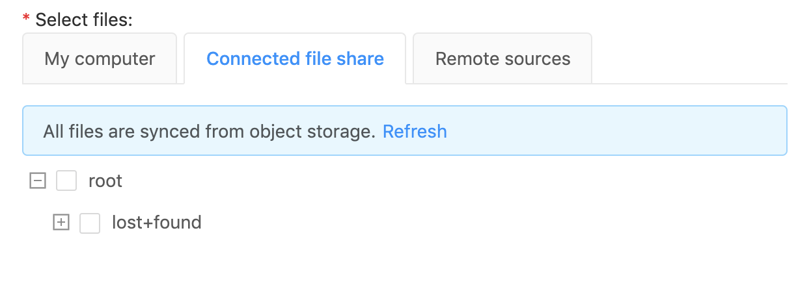

For this quick start, we'll be using OpenCV's [Computer Vision Annotation Tool (CVAT)](https://github.com/opencv/cvat). You will be able to use an existing model to pre-annotate your images or videos and then continuously train and improve your model on new data.

For this quick start, we'll setup CVAT on Onepanel, annotate some images, train a model on this images, and use this newly trained model for pre-annotation.

## Setting up CVAT

Onepanel is fully integrated with [Computer Vision Annotation Tool (CVAT)](https://github.com/opencv/cvat), allowing you to annotate images and videos and then train models on the annotated data with a few clicks. You can then use these newly trained models to automatically pre-annotate additional data, iteratively improving your object detection or semantic segmentation models.

:::tip
You can also bring your own labeling tool as a reproducible template in Onepanel. See our [Workspace templates documentation](/docs/reference/workspaces/templates) for more information.
:::

1. Go to **Workspaces** and click **Create Workspace**.

  

2. Select the CVAT template and enter a name for your Workspace.

  

3. Select a node pool that Onepanel will use to provision a machine for running CVAT. CVAT requires at least 16GB of RAM.

  
  :::note
  Some providers have limits on how many volumes you can attach to a node. The default CVAT template in Onepanel requires 3 volumes, so make sure to pick a machine that can support at least that many volumes.
  :::
  :::tip
  You can switch to a different node pool (for example one that supports GPUs) in a running Workspace at any time by clicking the Onepanel icon in the bottom right corner of your Workspace.
  :::

4. Click **Create and Run** to launch your CVAT Workspace.

5. Once CVAT is running, click **View**.

  

6. In CVAT, click **Create new task**.

  

7. Enter a name for your task and then under **Constructor**, add your labels. See [CVAT's user guide](https://github.com/opencv/cvat/blob/develop/cvat/apps/documentation/user_guide.md#creating-an-annotation-task) for additional information on more advanced label configuration.

8. Assuming you have already uploaded your images or videos to your object storage, under "Select files", click **Connected file share**.

  

9. Click the Onepanel icon in bottom right corner to bring up the Workspace panel.

10. Under **Workspace path**, type in the path to use to sync your object storage data to, then browse to the folder containing your images or videos under **Object storage location**.

  

11. Click **Sync to Workspace** to sync your files to this Workspace. Once syncing is complete, click **Refresh** and select your files.

  

12. Click **Submit** and then click the **Tasks** menu item to go to the tasks list.

13. Click **Open** to open task details.

  

14. Click **Job #1** to go into CVAT to start annotating your data. See [CVAT's user guide](https://github.com/opencv/cvat/blob/develop/cvat/apps/documentation/user_guide.md#interface-of-the-annotation-tool) for more information on the annotation tool interface.

## Annotating frames in CVAT

Once you have created a new task, you can start annotating your data. CVAT supports points, box, polylines, polygons for annotation. 

1. Click **Open** to open task details.

  

2. Click **Job #1** to go into CVAT to start annotating your data. See [CVAT's user guide](https://github.com/opencv/cvat/blob/develop/cvat/apps/documentation/user_guide.md#interface-of-the-annotation-tool) for more information on the annotation tool interface.

    - **Bounding boxes**:
    Select Box from the left sidebar and press N to start annotating once done, press N to finish annotation. Sometimes N will draw `rectangle shape` and sometimes it will draw `rectangle track`. In order to ensure you have the right one, draw one box by manually selecting Shape or Track from the UI. Once you manually select type of box from the UI, it will draw what you selected for the box everytime you press N.
      

    - **Polygons**:
    Similarly, select polygons and follow same procedure for annotation.
      

3. Press `ctrl` + `s` to save your task.
  :::tip
  It is highly recommended that you dump your annotation periodically. In case of any failure, this can be used to recover the tasks.
  :::

