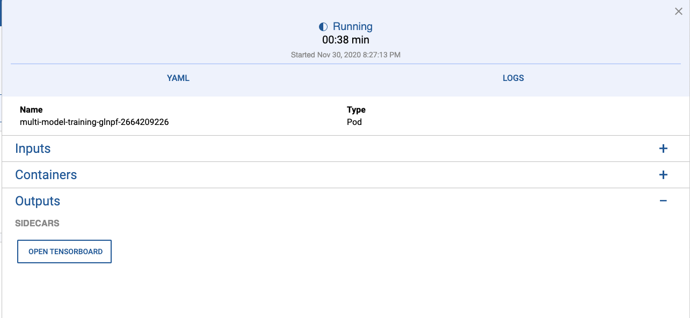

## Enabling TensorBoard

You can add TensorBoard as a `sidecar` to any Workflow template as follows:

```yaml
templates:  
  - name: my-template
    container:
     ...
    sidecars:
      - name: tensorboard                   
        # Use Tensorflow docker image    
        image: 'tensorflow/tensorflow:2.3.0'
        command:
          - sh
          - '-c'
        # Indicates that this is a visualization sidecar
        env:
          - name: ONEPANEL_INTERACTIVE_SIDECAR
            value: 'true'
        args:
          # Set <path> to where your main container is writing TensorBoard logs
          - tensorboard --logdir <path>     
        ports:
          - containerPort: 6006
            name: tensorboard
```

Full TensorFlow and TensorBoard example:

:::note
This example is also available in the application in **Workflows** under **TensorFlow Training**.
:::

```yaml {38,44,46-48,50-64,66-74}
entrypoint: main
templates:
  - name: main
    dag:
      tasks:
      - name: train-model
        template: tf-dense
  - name: tf-dense
    script:
      image: tensorflow/tensorflow:2.3.0
      command:
        - python
        - '-u'
      source: |
        import tensorflow as tf
        import datetime

        mnist = tf.keras.datasets.mnist

        (x_train, y_train),(x_test, y_test) = mnist.load_data()
        x_train, x_test = x_train / 255.0, x_test / 255.0

        def create_model():
          return tf.keras.models.Sequential([
            tf.keras.layers.Flatten(input_shape=(28, 28)),
            tf.keras.layers.Dense(512, activation='relu'),
            tf.keras.layers.Dropout(0.2),
            tf.keras.layers.Dense(10, activation='softmax')
          ])

        model = create_model()
        model.compile(optimizer='adam',
                      loss='sparse_categorical_crossentropy',
                      metrics=['accuracy'])

        # Write logs to /mnt/output
        log_dir = "/mnt/output/logs/" + datetime.datetime.now().strftime("%Y%m%d-%H%M%S")
        tensorboard_callback = tf.keras.callbacks.TensorBoard(log_dir=log_dir, histogram_freq=1)

        history = model.fit(x=x_train, 
                  y=y_train, 
                  epochs=10, 
                  validation_data=(x_test, y_test), 
                  callbacks=[tensorboard_callback])
      volumeMounts:
        # TensorBoard sidecar will automatically mount this volume
        - name: output
          mountPath: /mnt/output

    sidecars:
      - name: tensorboard
        image: 'tensorflow/tensorflow:2.3.0'
        command:
          - sh
          - '-c'
        env:
          - name: ONEPANEL_INTERACTIVE_SIDECAR
            value: 'true'
        args:
          # Read logs from /mnt/output - this directory is auto-mounted from volumeMounts
          - tensorboard --logdir /mnt/output/
        ports:
          - containerPort: 6006
            name: tensorboard

volumeClaimTemplates:
  # Provision a volume that can be shared between main container and TensorBoard side car
  - metadata:
      name: output
    spec:
      accessModes: [ "ReadWriteOnce" ]
      resources:
        requests:
          storage: 2Gi
```

## Launching TensorBoard

Once a Workflow task is running, you can access its TensorBoard sidecar by clicking on the task and then clicking **Outputs** in the task panel:

